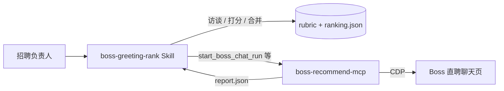

# Boss Greeting Rank · 招呼智排

[](LICENSE)
[](docs/install-openclaw.md)
[](docs/install-cursor.md)

**用你自己的招聘标准，给 Boss 直聘聊天页的候选人打招呼自动排序。**  
Agent 先访谈你的着重点 → 生成加权评分表 → 只读扫描招呼与简历 → 合并历史排名，新招呼增量上榜。

> 默认 **只读**：不发消息、不点「求简历」，适合 HR / 猎头在合规前提下做初筛。

---

## 为什么用

| 痛点 | 招呼智排怎么做 |
|------|----------------|
| 招呼太多，不知道先回谁 | 按你定义的维度（经验、学历、招呼质量等）算总分排序 |
| 每次标准不一致 | `rubric.json` 固化权重；跨多次运行合并 `ranking.json` |
| 只看简历不看招呼 | 单独 **打招呼维度**，持久化候选人首条消息原文 |
| 怕 Agent 乱发消息 | 内置只读护栏，禁止 `greeting_text` / 求简历类参数 |
| 扫一半卡住、跳人丢了 | stuck 恢复 playbook + skip 进榜带原因，不静默丢失 |

---

## 架构（两层，装一个 skill 即可）



- **本仓库（Skill）**：流程、护栏、Python 解析/合并脚本 — **MIT 开源**
- **运行时（Runtime）**：[`@reconcrap/boss-recommend-mcp`](https://www.npmjs.com/package/@reconcrap/boss-recommend-mcp) ≥ **2.0.57**（含招呼原文持久化）  
  - OpenClaw 通常已内置为 `boss-recommend__*` 工具，无需像 Cursor 那样单独配 MCP 面板  
  - 见 [runtime/README.md](runtime/README.md) 升级说明

---

## 快速安装

### OpenClaw（推荐）

```bash
git clone https://github.com/spikesubingrui-design/boss-greeting-rank.git
cd boss-greeting-rank
./install.sh openclaw
```

对 Agent 说：**「用 boss-greeting-rank 帮我给 XX 岗位打招呼排名」**。

详见 [docs/install-openclaw.md](docs/install-openclaw.md)。

### Cursor

```bash
./install.sh cursor
```

确保 Cursor 已启用 `user-boss-recommend`（或等价）MCP。详见 [docs/install-cursor.md](docs/install-cursor.md)。

---

## 典型流程

1. **首次**：`start_from=all` 扫全部招呼 → 生成 `ranking.json`
2. **日常**：`start_from=unread` 只扫新招呼 → 按 `candidate_key` 合并进榜
3. **解析**：`python3 scripts/extract_candidates.py <report.json>`
4. **合并**：`python3 scripts/merge_ranking.py <job_slug> scored.json`

数据目录：`~/.boss-recommend-mcp/boss-chat/greeting-rank/<job_slug>/`

完整字段说明见 [reference.md](reference.md)。

---

## 商业化与许可

| 版本 | 内容 |
|------|------|
| **Community（本仓库）** | MIT 开源：Skill + 脚本 + 文档，可自用、可改、可再分发（保留版权声明） |
| **Pro / 企业服务** | 多岗位模板、私有化部署、运行时托管、合规审计、定制维度 — 联系见下方 |

本仓库**不包含** Boss 直聘账号、LLM API Key 或 `screening-config.json` 中的密钥，请自行配置。

---

## 要求

- Node.js ≥ 18（运行时）
- Python 3（解析脚本）
- 已登录的 Boss 直聘招聘端 + Chrome DevTools（由 boss-recommend-mcp 管理）
- LLM：复用 `~/.boss-recommend-mcp/screening-config.json`

---

## 相关项目

- [boss-recommend-mcp](https://www.npmjs.com/package/@reconcrap/boss-recommend-mcp) — Boss 推荐/聊天/搜索自动化运行时
- OpenClaw 内置 `boss-chat` / `boss-recommend-pipeline` skill

---

## 贡献与支持

- 问题与功能请求：[GitHub Issues](https://github.com/spikesubingrui-design/boss-greeting-rank/issues)
- 贡献指南：[CONTRIBUTING.md](CONTRIBUTING.md)
- 变更记录：[CHANGELOG.md](CHANGELOG.md)

**企业合作 / 私有化**：请通过 Issue 标签 `enterprise` 或邮件联系维护者（在 fork 后替换为你的联系方式）。

---

<p align="center">
  <sub>Built with OpenPike · 开派智能</sub>
</p>
